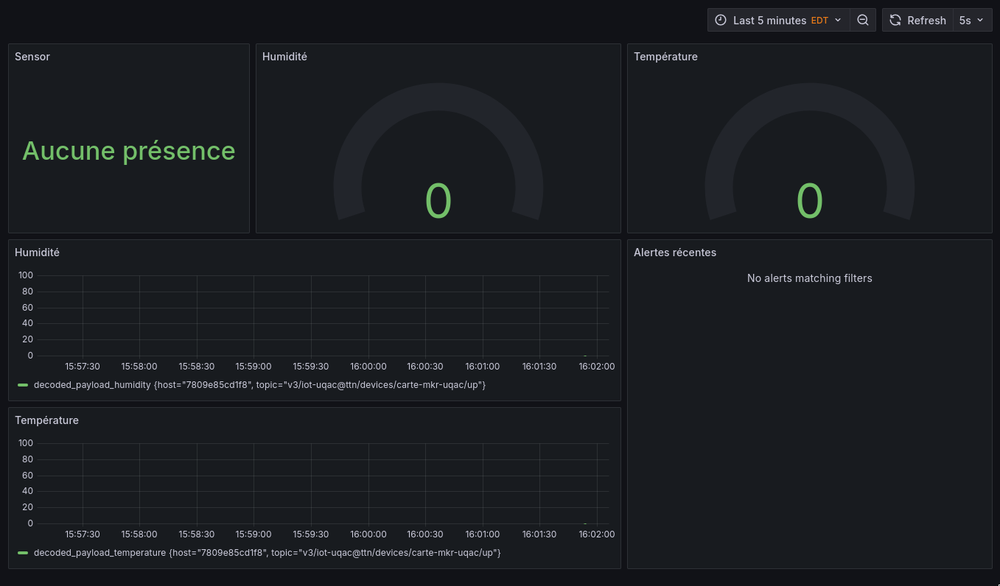

# IoT Data Collection Project 🌐📈

This project aims to develop a custom IoT solution to replace the Cayenne myDevice web application used in laboratory settings. The goal is to create a reliable and adaptable interface for monitoring data from a LoRaWAN node, with enhanced alert capabilities suitable for industrial deployment. The project involves setting up a network to collect, store, and visualize sensor data, and generate alerts based on predefined thresholds.

### Key Features and Implementation 🚀

- **Hardware**: Utilized an MKR1310 board equipped with sensors for:
  - Temperature 
  - Humidity 
  - Presence 

- **Data Flow**:
  - Sensor data is transmitted to The Things Stack.
  - Telegraf retrieves the data and forwards it to InfluxDB for storage.

- **Visualization**:
  - Grafana is used to create customizable dashboards for data visualization.

- **Alert Mechanisms**:
  - Email notifications 📧
  - Discord messages 💬
  - SMS alerts (functional with Canadian phone numbers) 📱


### How to set it up and configure it 🚀

We focused on automating the setup process to ensure minimal configuration is required. To get started, simply run:

```sh
docker compose up
```

Access Grafana using the following address: [http://localhost:3000](http://localhost:3000). For login, use the dummy credentials provided:
- **Login**: `grafadmin`
- **Password**: `grafpw`



### Environment Configuration ⚙️

Ensure you have a `.env` file available with the following information:

```env
MQTT_PASSWORD=your-mqtt-password

SMTP_HOST=your-smtp-server
SMTP_PORT=your-port
SMTP_USER=the-email-that-will-send-data

# Note: We used Mailjet, so this section may vary based on your provider
SMTP_USER_ID=
SMTP_USER_PW=
```
